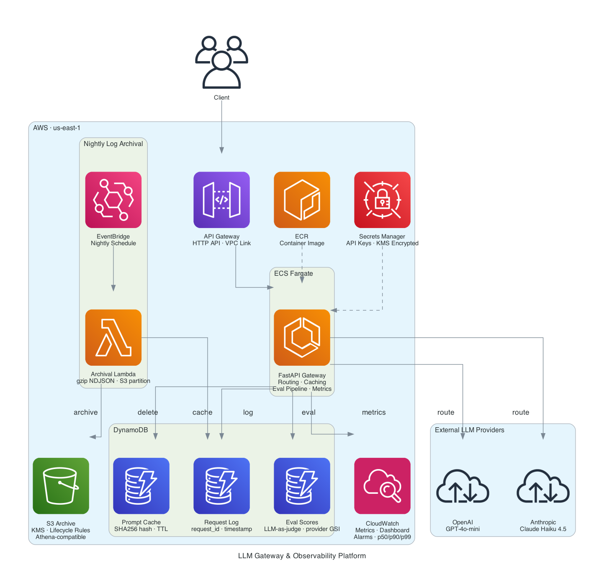

# LLM Gateway & Observability Platform

A production grade multi provider LLM proxy deployed on AWS ECS Fargate. Routes requests across OpenAI (GPT-4o-mini) and Anthropic (Claude Haiku 4.5) based on cost, latency, or quality strategy. Caches responses in DynamoDB, logs every request, emits CloudWatch metrics, and runs an automated eval pipeline using LLM as judge.

## Architecture



```
Client → API Gateway (HTTP) → VPC Link → ECS Fargate → OpenAI / Anthropic
                                              │
                              ┌────────────────┼────────────────┐
                              │                │                │
                         DynamoDB          CloudWatch        S3 Archive
                     (cache, logs, eval)   (metrics,        (gzipped NDJSON,
                                           dashboard,       lifecycle rules)
                                           alarms)
```

## Key Features

**Intelligent Routing** — Cost, latency, and quality strategies select the optimal provider per request. Override with explicit provider selection when needed.

**Response Caching** — SHA256 prompt hashing with DynamoDB TTL. Cached responses return in 0ms at zero cost.

**Full Observability** — CloudWatch dashboard tracks request latency (p50/p90/p99), token usage by provider, estimated cost, cache hit rate, error rate, eval quality scores, and feedback signals. Alarms fire on high error rate, quality drift, and daily cost spikes.

**Eval Pipeline** — 10% of requests are sampled and scored 1 to 5 by an LLM judge on accuracy, helpfulness, clarity, and completeness. Results stored in DynamoDB with CloudWatch metrics for quality monitoring over time.

**Log Archival** — Nightly Lambda scans DynamoDB for records older than 7 days, compresses them to gzipped NDJSON with date partitioned S3 keys (Athena compatible), then deletes archived records.

**Scale to Zero** — ECS Application Auto Scaling shuts down Fargate tasks evenings and weekends (America/Chicago timezone) to minimize cost during non demo hours.

## Security Hardening

- VPC endpoints for DynamoDB, S3, Secrets Manager, CloudWatch, and ECR (gateway + interface)
- KMS customer managed keys for Secrets Manager and S3 encryption
- Container runs as non root user (1000:1000) with read only root filesystem and all Linux capabilities dropped
- S3 public access blocked with TLS 1.2 enforced via bucket policy
- ECS security group ingress scoped exclusively to API Gateway VPC Link
- Secrets injected at runtime via ECS Secrets Manager integration (never baked into image)

## AWS Services

ECS Fargate, API Gateway (HTTP), DynamoDB (3 tables), S3 (KMS encrypted, lifecycle rules), Secrets Manager (KMS), CloudWatch (dashboard + alarms), Lambda, EventBridge, ECR, VPC, NAT Gateway, Cloud Map

## Tech Stack

Python 3.12, FastAPI, uvicorn, httpx, boto3, Pydantic, Docker, Terraform

## API Endpoints

| Endpoint       | Method | Description                       |
| -------------- | ------ | --------------------------------- |
| `/health`      | GET    | Health check with provider status |
| `/v1/complete` | POST   | Route a completion request        |
| `/v1/feedback` | POST   | Submit feedback on a response     |
| `/docs`        | GET    | Interactive Swagger UI            |

### Example Request

```bash
curl -X POST https://<api-gateway-url>/v1/complete \
  -H "Content-Type: application/json" \
  -d '{
    "prompt": "What is cloud computing?",
    "strategy": "cost",
    "max_tokens": 100
  }'
```

### Example Response

```json
{
  "request_id": "aba9f7df-682c-4576-a5ae-96e479bf3366",
  "provider": "openai",
  "model": "gpt-4o-mini-2024-07-18",
  "content": "Cloud computing is the delivery of computing services over the internet...",
  "input_tokens": 15,
  "output_tokens": 35,
  "latency_ms": 1760.73,
  "estimated_cost_cents": 0.002325,
  "cached": false,
  "strategy_used": "cost"
}
```

## Project Structure

```
llm-gateway/
├── app/
│   ├── main.py                  # FastAPI entry point
│   ├── core/
│   │   ├── __init__.py          # Settings from environment
│   │   ├── aws.py               # Centralized boto3 clients
│   │   ├── router.py            # Strategy based provider selection
│   │   ├── cache.py             # DynamoDB prompt cache
│   │   └── request_logger.py    # DynamoDB request logging
│   ├── providers/
│   │   ├── __init__.py          # Base LLMProvider class
│   │   ├── openai_provider.py   # OpenAI GPT-4o-mini
│   │   └── anthropic_provider.py # Anthropic Claude Haiku 4.5
│   ├── models/
│   │   └── __init__.py          # Pydantic request/response models
│   ├── observability/
│   │   └── __init__.py          # CloudWatch metric emitters
│   ├── eval/
│   │   └── __init__.py          # LLM as judge eval pipeline
│   └── routers/
│       └── __init__.py          # API route handlers
├── terraform/
│   ├── main.tf                  # Root module composition
│   ├── variables.tf             # Input variables
│   └── modules/
│       ├── networking/          # VPC, subnets, endpoints, security groups
│       ├── ecs/                 # Cluster, task def, service, IAM, Cloud Map
│       ├── dynamodb/            # Request log, cache, eval tables
│       ├── s3/                  # Log archive bucket with KMS and lifecycle
│       ├── secrets/             # Secrets Manager with KMS
│       ├── api_gateway/         # HTTP API with VPC Link
│       ├── monitoring/          # CloudWatch dashboard and alarms
│       ├── lambda/              # Nightly log archival function
│       └── scheduling/          # Scale to zero auto scaling
├── lambda/
│   └── log_archival/
│       └── handler.py           # EventBridge triggered archival
├── Dockerfile
├── requirements.txt
└── docker-compose.yml           # Local dev with DynamoDB Local
```

## Deployment

Infrastructure is managed entirely with Terraform using an S3 backend.

```bash
# Build and push container
docker build --platform linux/amd64 -t llm-gateway .
docker tag llm-gateway:latest <account>.dkr.ecr.us-east-1.amazonaws.com/llm-gateway:latest
docker push <account>.dkr.ecr.us-east-1.amazonaws.com/llm-gateway:latest

# Deploy infrastructure
cd terraform
terraform init
terraform apply
```

## Local Development

```bash
docker-compose up
```

Runs the FastAPI app with DynamoDB Local for offline development.

## Terraform Outputs

| Output | Description |
|---|---|
| `api_endpoint` | API Gateway endpoint URL |
| `ecs_cluster_name` | ECS cluster name |
| `ecs_service_name` | ECS service name |
| `cloudwatch_dashboard_url` | CloudWatch dashboard URL |
| `log_archive_bucket` | S3 bucket for archived request logs |
| `ecr_repository_url` | ECR repository URL for pushing container images |
| `request_log_table_name` | DynamoDB request log table name — consumed by the [AWS Cost Intelligence Dashboard](https://github.com/jordann6/aws-cost-intelligence-dashboard) to ingest LLM API spend |
| `request_log_table_arn` | DynamoDB request log table ARN |

## Integrations

The gateway's DynamoDB request log table (`request_log_table_name`) is consumed by the [AWS Cost Intelligence Dashboard](https://github.com/jordann6/aws-cost-intelligence-dashboard). A dedicated LLM ingester Lambda scans the table daily, aggregates `estimated_cost_cents` by provider, and writes the totals into the FinOps dashboard alongside AWS service costs — giving z-score anomaly detection and 14-day spend forecasting across both infrastructure and LLM API spend.
